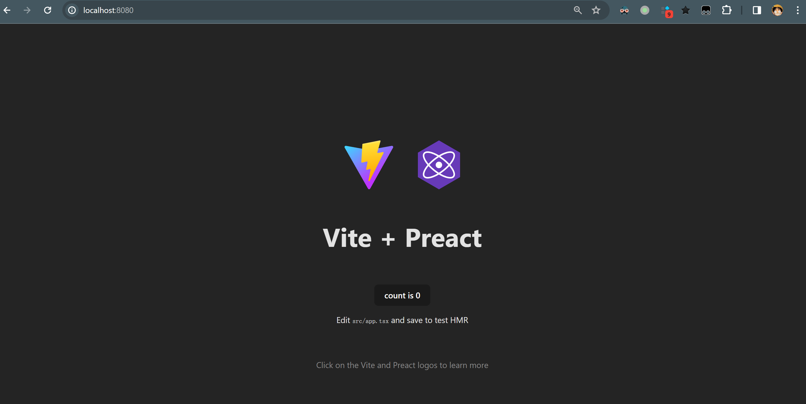
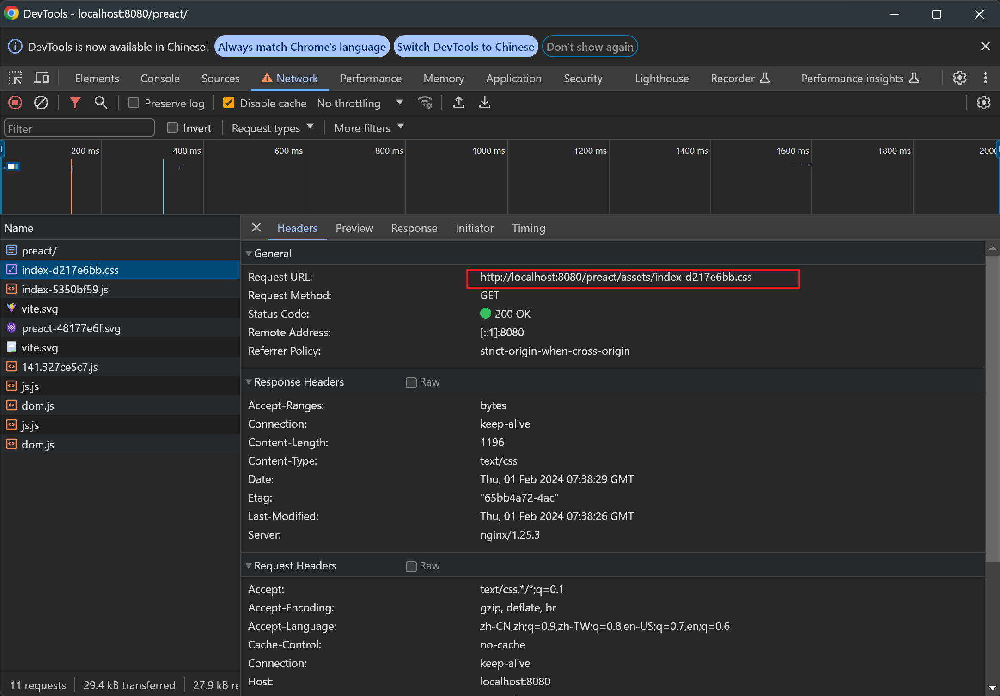

在开发中常常会出现需要在一个域名下部署多个不同前端工程的场景.而这种场景在前端开发者本机不方便调试，因此我们可以选择用 docker 帮忙，在本地模拟 nginx 多级目录的情况。这在帮助我们排查“本地开发项目访问网页正常，部署后访问网页异常”及类似问题时十分有用。

本篇分以下步骤来逐步讲解：
1. 如何将打包后的 dist 文件跑在 docker 内的 nginx 中？
2. 如何将打包行为放到 docker 容器内执行？
3. 如何模拟 nginx 多级目录的情况？

## 如何将打包后的 dist 文件跑在 docker 内的 nginx 中？

我们首先使用 vite 新建一个项目：

```bash
npm create vite@latest
√ Project name: ... preact
√ Select a framework: » Preact
√ Select a variant: » TypeScript

Scaffolding project in D:\code\tmp\preact...

Done. Now run:

  cd preact
  npm install
  npm run dev
```

进入文件夹内，执行打包命令来生成 dist 文件夹：

```bash
cd preact 
npm install 
npm run build
```

```
├───dist
│   │   index.html
│   │   vite.svg
│   └───assets
│           index-b02f14d5.js
│           index-d217e6bb.css
│           preact-48177e6f.svg
```

接下来我们进入利用 docker 跑 nginx 的步骤，如何安装 docker 请参照[docker官方文档](https://www.docker.com/)，本文不再赘述。

我们根据 [docker hub 上的 nginx 镜像](https://hub.docker.com/_/nginx)的指引，在文件夹下新建一个 preact/Dockerfile 文件：

```Dockerfile
FROM nginx
COPY dist /usr/share/nginx/html
```

- `FROM nginx` 表示我们要使用 nginx 的 image
- `COPY dist /usr/share/nginx/html` 表示将 dist 文件夹中的内容拷贝到容器中的 `/usr/share/nginx/html` 目录下，这个目录是 nginx 默认的解析目录。

然后我们执行 `docker build` 命令，生成一个带有 nginx 的本地镜像 ：

```bash
docker build -t preact-nginx .
```

利用 image 生成并启动一个 container，并将容器的 80 端口映射到本机的 8080 端口上：

```bash
docker run --name preact-nginx-container -d -p 8080:80 preact-nginx
```

- `--name preact-nginx-container` ：声明 container 的名字
- `-d`: detach（分离），表示后台运行容器，并返回容器ID
- `-p 8080:80`: 将容器的 80 端口映射到本机的 8080 端口上
- `preact-nginx`： 使用 image: preact-nginx

此时我们打开网页 `http://localhost:8080` 就可以看到部署在容器中的网页了：



## 如何将打包行为放到 docker 容器内执行？

为了将打包放到 docker 容器内，我们需要使用 docker 的 [multi-stage](https://docs.docker.com/build/building/multi-stage/) 功能。即我们将修改 Dockerfile 文件，让其执行两步操作：
1. 获取 node 镜像，并用该镜像执行 `npm install` & `npm run build` 命令
2. 获取 nginx 镜像，并把第一步通过 `npm run build` 命令生成的 `dist` 文件夹拷贝到该镜像中

```Dockerfile
FROM node AS build
WORKDIR /usr/src/app
COPY . .
RUN npm install --registry=https://registry.npmmirror.com
RUN npm run build

FROM nginx
COPY --from=build /usr/src/app/dist /usr/share/nginx/html
```

- `FROM node AS build` : 获取 `node` 镜像，并为当前环境定义别名 `build`
- `WORKDIR /usr/src/app` : 进入工作目录 `/usr/src/app` 中
- `COPY . .`: 将本机当前文件夹下的所有文件拷贝到工作目录下
- `COPY --from=build /usr/src/app/dist /usr/share/nginx/html`: 将 `node` 镜像环境中的 `/usr/src/app/dist` 拷贝到 `nginx` 环境的 `/usr/share/nginx/html` 目录下

删除容器和镜像：

```bash
docker container kill preact-nginx-container
docker container remove preact-nginx-container
docker image remove preact-nginx
```

重新生成镜像和容器并运行，我们应该可以得到与第一步工作相同的结果：

```bash
docker build -t preact-nginx .
docker run --name preact-nginx-container -d -p 8080:80 preact-nginx
```


## 如何模拟 nginx 多级目录的情况？

我们原本是将 `dist` 文件夹复制到 `/usr/share/nginx/html` 文件夹下，最简单的将其部署到子路径下的方法就是简单将 `dist` 文件夹复制到 `/usr/share/nginx/html/preact` 文件夹下，这样在访问 `http://localhost:8080/preact/` 时就可以访问到我们部署的网页了：

```Dockerfile
...
COPY --from=build /usr/src/app/dist /usr/share/nginx/html/preact
```

删除容器和镜像：

```bash
docker container kill preact-nginx-container
docker container remove preact-nginx-container
docker image remove preact-nginx
```

重新生成镜像和容器并运行：

```bash
docker build -t preact-nginx .
docker run --name preact-nginx-container -d -p 8080:80 preact-nginx
```

此时我们访问 http://localhost:8080/preact，会发现页面白屏，打开 DevTools 可以看到静态资源的访问 404 了：


为什么呢？这是因为我们将资源放到了 `/usr/share/nginx/html/preact` 文件夹下，即静态资源的路径是 `/usr/share/nginx/html/preact/assets/index-d217e6bb.css` 。 而我们请求的地址却是： `http://localhost:8080/assets/index-d217e6bb.css` ，它查找的是 `/usr/share/nginx/html/assets/index-d217e6bb.css` ，没有到 `preact` 文件夹中查找，导致资源无法被访问到，返回了404错误码。

我们可以验证一下我们的想法，我们检查 `dist/index.html` 文件：

```html
<!doctype html>
<html lang="en">
  <head>
    ...
    <script type="module" crossorigin src="/assets/index-5350bf59.js"></script>
    <link rel="stylesheet" href="/assets/index-d217e6bb.css">
  </head>
  <body>
    <div id="app"></div>
  </body>
</html>
```

这里的 css 和 js 文件指向的地址是 `/assets/index-5350bf59.js` 和 `/assets/index-d217e6bb.css` ，我们只需要为这两个资源的引用加上文件夹前缀，即 `/preact/assets/index-5350bf59.js` 和 `/preact/assets/index-d217e6bb.css` ，就可以访问到子文件夹中的资源文件了。

而静态文件是 `vite` 帮助我们编译生成的，[其同样提供了更改静态资源根目录的能力](https://vitejs.dev/guide/build)，我们可以到 `vite.config.ts` 文件夹下通过 `base` 参数设置静态资源的根路径：

```ts
// vite.config.ts
import { defineConfig } from 'vite'
import preact from '@preact/preset-vite'

// https://vitejs.dev/config/
export default defineConfig({
  plugins: [preact()],
  base: "preact"
})
```

我们可以本地运行一下 `npm run build` 命令，可以看到 `dist/index.html` 已经发生了改变：

```html
<!doctype html>
<html lang="en">
  <head>
    ...
    <script type="module" crossorigin src="/preact/assets/index-5350bf59.js"></script>
    <link rel="stylesheet" href="/preact/assets/index-d217e6bb.css">
  </head>
  <body>
    <div id="app"></div>
    
  </body>
</html>

```

删除容器和镜像：

```bash
docker container kill preact-nginx-container
docker container remove preact-nginx-container
docker image remove preact-nginx
```

重新生成镜像和容器并运行：

```bash
docker build -t preact-nginx .
docker run --name preact-nginx-container -d -p 8080:80 preact-nginx
```

可以访问到资源了：



## Option: 在上面的简单示例中，nginx 是如何匹配资源的？

我们前面提到了 `http://localhost:8080/assets/index-d217e6bb.css` 无法正确访问到 docker 容器内的静态资源。我们可以通过查看 docker 容器内的 nginx 配置来简单验证一下我们的想法。为了方便查看，我们通过 `docker cp` 命令将容器内的配置文件拷贝出来查看：

```bash
docker cp preact-nginx-container:/etc/nginx/nginx.conf ./
```

```nginx.conf
...

http {
    ...

    include /etc/nginx/conf.d/*.conf;
}

```

其进一步引用了 `/etc/nginx/conf.d/` 目录下以 `conf` 为后缀的配置文件，我们同样将其拷贝出来：

```bash
docker cp preact-nginx-container:/etc/nginx/conf.d/ ./
```

```default.conf
server {
    listen       80;
    listen  [::]:80;
    server_name  localhost;

    location / {
        root   /usr/share/nginx/html/;
        index  index.html index.htm;
    }
}
```

- 当我们访问 `http://localhost:8080/preact/` 时，`location` 匹配到了 `/preact/` 路径，其到 `root` 路径下查找资源，即 `/usr/share/nginx/html/preact/` ，查找到了 `index.html` 文件并返回。
- `index.html` 引用了 `/assets/index-d217e6bb.css` 静态资源，于是发出了 `http://localhost:8080/assets/index-d217e6bb.css` 请求，`location` 匹配到了 `/assets/index-d217e6bb.css` 资源，其到 `root` 路径下查找资源，即 `/usr/share/nginx/html/assets/index-d217e6bb.css` ，未找到该资源，返回 404.
- 若 `index.html` 引用了 `/preact/assets/index-d217e6bb.css` 静态资源，将发出了 `http://localhost:8080/preact/assets/index-d217e6bb.css` 请求，`location` 匹配到了 `/preact/assets/index-d217e6bb.css` 资源，其到 `root` 路径下查找资源，即 `/usr/share/nginx/html/preact/assets/index-d217e6bb.css` ，找到并返回该资源.


## 参考资源

- docker 镜像配置：https://gist.github.com/y0ngb1n/7e8f16af3242c7815e7ca2f0833d3ea6
- npm镜像站：https://npmmirror.com/
- docker-nginx: https://hub.docker.com/_/nginx